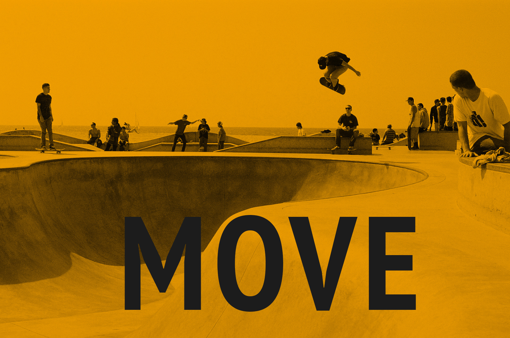

# MOVE

### [See Live](https://gabrielecanepa.github.io/move)

---

**MOVE** is an `HTML`, `CSS` and `JavaScript` powered web template.

It was realized after completing all the introduction courses on 

The project was mainly inspired by the course [Learn JavaScript](https://www.codecademy.com/learn/learn-javascript).
